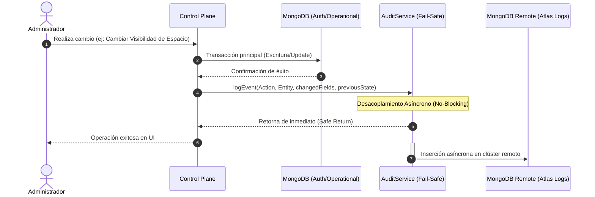
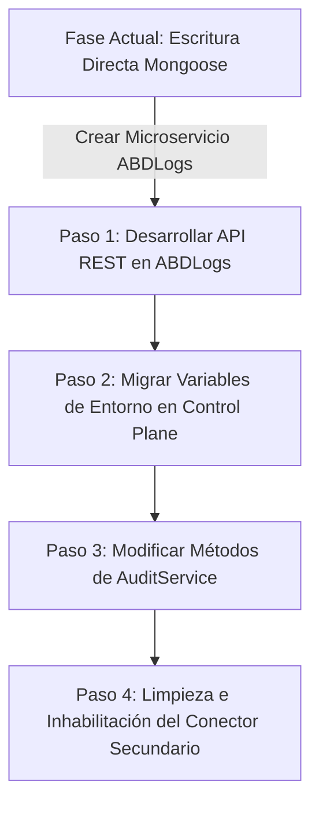

# 📊 Arquitectura de Auditoría SaaS & Guía de Migración a `ABDLogs`

Este documento describe la especificación técnica, el modelo de datos y el flujo de integración de la telemetría de auditoría de **ABD Gobernanza**. Ha sido diseñado bajo un enfoque modular y portátil, permitiendo migrar de manera ágil el almacenamiento directo actual a un microservicio centralizado independiente denominado **`ABDLogs`** cuando sea necesario.

---

## 🏛️ 1. Arquitectura General y Filosofía de Diseño

El sistema de auditoría del Control Plane opera bajo tres principios industriales:
1.  **Aislamiento de Persistencia (Multi-Connection)**: El motor operativo principal (`ABDElevators-Auth`) y el motor de telemetría de auditoría (`ABDElevators-Logs`) están completamente desacoplados. Se comunican mediante pools de conexión aislados para prevenir contaminación de datos y fatiga de conexiones en entornos Serverless.
2.  **Transacciones Fail-Safe (No Bloqueantes)**: La escritura de logs de auditoría se dispara de manera asíncrona sin bloquear el flujo principal del usuario. Si el clúster de logs está fuera de servicio o presenta latencia, la aplicación registra un warning pero completa la transacción de negocio con éxito.
3.  **Registro de Deltas Semánticos**: En lugar de almacenar representaciones completas de los documentos, el sistema calcula el "antes" y el "después" (`changedFields` vs `previousState`), permitiendo reconstruir visualmente cualquier cambio sin duplicar el almacenamiento.



---

## 🗃️ 2. Modelo de Datos y Contrato de Auditoría

El motor almacena dos flujos de auditoría independientes según la naturaleza de la acción. Ambos heredan una estructura base común para garantizar la compatibilidad semántica.

### Esquema Común (Base Telemetry Schema)
| Atributo | Tipo de Dato | Propósito | Ejemplo |
| :--- | :--- | :--- | :--- |
| `tenantId` | `String` | Identificador único de la organización del contexto. | `"tenant_abc123"` |
| `action` | `String` | Código identificador de la operación realizada. | `"HERITAGE_VISIBILITY"` |
| `entityType` | `Enum` | Categoría de la entidad (`SPACE` o `TENANT`). | `"SPACE"` |
| `entityId` | `String` | ID de la entidad afectada. | `"60d5ec49f832c222b8812c3f"` |
| `userId` | `String` | ID del operador que realizó la acción. | `"60d5ec49f832c222b8812c30"` |
| `userEmail` | `String` | Correo electrónico del operador. | `"admin@abd.com"` |
| `changedFields` | `Record<string, any>` | Objeto dinámico con los nuevos valores del cambio (Delta). | `{"visibility": "PRIVATE"}` |
| `previousState` | `Record<string, any>` | Objeto dinámico con los valores anteriores del cambio (Antes). | `{"visibility": "PUBLIC"}` |
| `createdAt` | `Date` | Marca de tiempo UTC del evento. | `2026-05-18T15:00:00.000Z` |

### Flujos de Destino (Compass Collections)
1.  **`audit_config_changes`**:
    *   **Acciones**: `UPDATE_BRANDING`, `CREATE_TENANT`, `DELETE_TENANT`.
    *   **Políticas de Privacidad**: El sistema intercepta y enmascara automáticamente valores sensibles (como el `taxId` o secretos de encriptación) convirtiéndolos a `"[_SENSITIVE_DATA_]"` antes de la ingesta.
2.  **`audit_admin_ops`**:
    *   **Acciones**: `CREATE_SPACE`, `UPDATE_SPACE`, `DELETE_SPACE`, `MOVE_SPACE`, `HERITAGE_VISIBILITY`.
    *   **Propagación en Cascada**: El evento `HERITAGE_VISIBILITY` se registra de forma individual para cada sub-espacio afectado durante una propagación recursiva de permisos.

---

## ⚙️ 3. Implementación Actual en el Control Plane

El ecosistema actual encapsula toda la infraestructura de logs en tres módulos independientes dentro de la arquitectura limpia:
1.  **Conector Aislado ([mongodb-logs.ts](file:///d:/desarrollos/ABDtenantGobernance/src/lib/database/mongodb-logs.ts))**: Establece y almacena en caché global la conexión secundaria apuntando a `MONGODB_LOGS_URI`.
2.  **Esquemas e Ingestores ([AuditLog.ts](file:///d:/desarrollos/ABDtenantGobernance/src/models/AuditLog.ts))**: Declara los modelos enlazados dinámicamente a la conexión secundaria para evitar colisiones de compilación.
3.  **Orquestador de Auditoría ([audit-service.ts](file:///d:/desarrollos/ABDtenantGobernance/src/services/tenant/audit-service.ts))**: Ofrece los métodos públicos `logEvent` y `getCombinedLogsByTenant`.

### Ejemplo de Disparo en Capa de Negocio (`space-service.ts`):
```typescript
// 🛡️ Ingesta asíncrona Fail-Safe
AuditService.logEvent({
  tenantId,
  action: 'HERITAGE_VISIBILITY',
  entityType: 'SPACE',
  entityId: childId,
  userId,
  userEmail,
  changedFields: { visibility: newVisibility },
  previousState: { visibility: oldVisibility }
}).catch(err => {
  console.warn('[AUDIT_LOG_STREAM_FAILURE_WARNING] Falló la ingesta de auditoría remota:', err);
});
```

---

## 🚀 4. Plan de Migración Paso a Paso Hacia el Microservicio `ABDLogs`

Cuando decidas centralizar estos logs en una nueva aplicación independiente (`ABDLogs`), el acoplamiento en el Control Plane es tan bajo que la migración se completará en **4 sencillos pasos** sin romper la lógica del negocio:



### Paso 1: Desarrollar la API de Ingesta en `ABDLogs`
El nuevo microservicio `ABDLogs` deberá heredar la conexión a `mongodb-logs.ts` y exponer dos endpoints REST protegidos por token de servicio:
1.  **`POST /api/logs`**: Registra un nuevo log de auditoría.
    ```json
    {
      "tenantId": "tenant_123",
      "action": "UPDATE_BRANDING",
      "entityType": "TENANT",
      "entityId": "tenant_123",
      "userId": "usr_99",
      "userEmail": "admin@abd.com",
      "changedFields": { "primaryColor": "#ffffff" },
      "previousState": { "primaryColor": "#000000" }
    }
    ```
2.  **`GET /api/logs?tenantId={id}&limit={limit}`**: Recupera cronológicamente la lista unificada de logs.

### Paso 2: Configurar Credenciales de Servicio en `.env.local`
Sustituir la URI directa de MongoDB por la URI del nuevo microservicio y añadir un token de autenticación inter-servicio seguro:
```env
# MONGODB_LOGS_URI=mongodb+srv://... (Eliminar)
ABDLOGS_API_URL=https://logs.abd-elevators.com/api
ABDLOGS_API_KEY=sb_sec_prod_a982fbc812903e
```

### Paso 3: Actualizar el Servicio de Auditoría (`audit-service.ts`)
Modificar los métodos internos de `AuditService` para consumir la API de `ABDLogs` mediante peticiones HTTP seguras (`fetch`), en lugar de instanciar modelos Mongoose locales. El contrato de firmas del servicio permanecerá idéntico, garantizando impacto cero en tus controladores y lógica de negocio:

```typescript
// src/services/tenant/audit-service.ts
export class AuditService {
  private static apiUrl = process.env.ABDLOGS_API_URL;
  private static apiKey = process.env.ABDLOGS_API_KEY;

  static async logEvent(params: AuditLogParams): Promise<void> {
    try {
      // Ocultar datos de alta confidencialidad
      const sanitizedChanges = { ...params.changedFields };
      if (sanitizedChanges.taxId) sanitizedChanges.taxId = '[ENCRYPTED_DATA]';

      await fetch(`${this.apiUrl}/logs`, {
        method: 'POST',
        headers: {
          'Content-Type': 'application/json',
          'Authorization': `Bearer ${this.apiKey}`
        },
        body: JSON.stringify({ ...params, changedFields: sanitizedChanges })
      });
    } catch (error) {
      console.error('[ABDLOGS_MICROSERVICE_INGEST_ERROR]', error);
    }
  }

  static async getCombinedLogsByTenant(tenantId: string, limit = 50): Promise<any[]> {
    try {
      const res = await fetch(`${this.apiUrl}/logs?tenantId=${tenantId}&limit=${limit}`, {
        headers: { 'Authorization': `Bearer ${this.apiKey}` }
      });
      return await res.json();
    } catch (error) {
      console.error('[ABDLOGS_MICROSERVICE_FETCH_ERROR]', error);
      return [];
    }
  }
}
```

### Paso 4: Eliminar Archivos de Conexión Locales Obsoletos
Una vez verificado que el flujo HTTP funciona en producción, puedes borrar de forma segura:
*   `src/lib/database/mongodb-logs.ts` (Conector eliminado)
*   `src/models/AuditLog.ts` (Modelos locales eliminados)

¡Listo! Con este diseño modular e industrial, has blindado la escalabilidad a largo plazo de la plataforma. La transición a **`ABDLogs`** será transparente y libre de fricciones técnicas.
