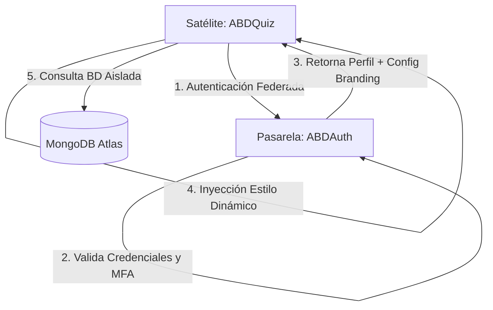
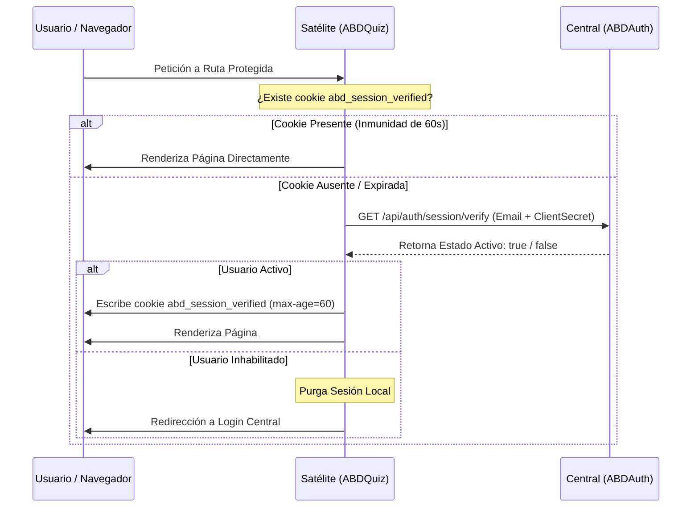

# 🏛️ Especificación de Gobernanza y Arquitectura Multi-Tenant

Este documento recopila de forma exhaustiva los pilares de diseño, protocolos de comunicación, seguridad perimetral, aislamiento de datos y tematización dinámica que rigen el ecosistema multi-tenant de la suite de aplicaciones **ABD (ABDAuth, ABDQuiz, ABDAgRAG y satélites)**.

---

## 🏛️ 1. Arquitectura General del Ecosistema

El ecosistema opera bajo un modelo de **Identidad Federada Centralizada** con **Satélites Especializados de Negocio**, orquestado de la siguiente manera:



*   **Identidad y Gobernanza Centralizada (`ABDAuth`)**: Actúa como el Proveedor de Identidad (IdP) canonical. Administra usuarios, tenants, aplicaciones clientes registradas (satélites), políticas de MFA (TOTP) y personalización visual (Branding).
*   **Aplicaciones Satélite (`ABDQuiz`, `ABDAgRAG`)**: Consumen la identidad de `ABDAuth`, aíslan las colecciones/bases de datos en base al token de sesión y aplican los estilos en tiempo de ejecución de forma transparente.

---

## 🔑 2. Ciclo de Vida del SSO Federado y Contrato de Token

La autenticación se realiza mediante un flujo inspirado en OAuth 2.1 / OIDC:

1.  **Redirección al IdP**: El satélite redirige al usuario a `ABDAuth` con parámetros seguros (`client_id`, `state`, `redirect_uri`).
2.  **Validación y MFA**: El usuario introduce sus credenciales y resuelve el segundo factor (MFA) si el Tenant o su rol lo exigen.
3.  **Código de Autorización**: `ABDAuth` genera un código de autorización temporal y redirige de vuelta al satélite.
4.  **Intercambio de Token**: El satélite intercambia el código por el perfil de usuario a través del endpoint interno `/api/auth/federated/token`.

### 📄 Contrato de Datos de Sesión (Estructura del Payload)
El payload de usuario retornado por `ABDAuth` y almacenado en la cookie segura `abd_session` del satélite define completamente los límites del Tenant:

```json
{
  "id": "60c72b2f9b1d8a23c4a10d9e",
  "email": "auditor@academia1.com",
  "name": "Carlos",
  "surname": "Sánchez",
  "role": "AUDITOR",
  "tenantId": "tenant_academia_01",
  "dbPrefix": "aca1",
  "isolationStrategy": "COLLECTION_PREFIX",
  "branding": {
    "logoUrl": "https://cdn.abd.com/logos/academia1.png",
    "theme": {
      "primary": "#ef4444",
      "rounded": true,
      "radius": "0.5rem"
    }
  }
}
```

---

## 🛡️ 3. Gobernanza del Desfase de Roles y Deactivaciones Tardías

Dado que el satélite almacena la sesión localmente por 8 horas, cambios de roles o desactivaciones de cuentas realizados en el panel administrativo de `ABDAuth` podrían sufrir de **desfase de privilegios**. Para solucionarlo sin sobrecargar la red, se implementó el **Active Verification Guard**:



*   **Network Immunity Window (60 segundos)**: Al verificar con éxito al usuario contra el IdP, el satélite escribe una cookie temporal corta `abd_session_verified` con duración de 60 segundos. Durante este intervalo, no se realizan llamadas de servidor a servidor, protegiendo el rendimiento de la aplicación.

---

## 🚪 4. Front-Channel Single Log-Out (SLO)

Para garantizar la destrucción absoluta de sesiones en todo el ecosistema de forma simultánea, se implementó el protocolo de **Cierre de Sesión en Cascada**:

1.  **Petición de Logout**: El usuario clica en salir en cualquier aplicación. La petición se centraliza en `ABDAuth` (`/api/auth/logout`).
2.  **Destrucción de Cookies Centrales**: `ABDAuth` purga sus propias cookies y registros de sesión activa en la base de datos de MongoDB.
3.  **Cascada Silenciosa (Iframe Loop)**: `ABDAuth` renderiza un HTML dinámico que carga un conjunto de `<iframe>` invisibles apuntando al endpoint de logout silencioso de cada satélite registrado:
    ```html
    <iframe src="https://abdquiz.vercel.app/api/auth/logout?silent=true" style="display:none;"></iframe>
    <iframe src="https://abdagrag.vercel.app/api/auth/logout?silent=true" style="display:none;"></iframe>
    ```
4.  **Limpieza Local de Satélites**: Al recibir `?silent=true`, el satélite destruye la cookie de sesión `abd_session` escribiendo cabeceras anti-caché y expiración en época (`new Date(0)`), previniendo la conservación de cookies de sesión en navegadores basados en Webkit/Chromium.
5.  **Redirección Final**: Transcurrido un fallback de seguridad de `1500ms` (o mediante eventos `onload`), `ABDAuth` redirige al usuario a la página de login limpio.

---

## 🗄️ 5. Estrategias de Aislamiento de Datos

La suite soporta dos niveles de aislamiento de datos en MongoDB según el nivel de aislamiento y presupuesto del Tenant:

### Nivel 1: `COLLECTION_PREFIX` (Aislamiento Lógico Compartido)
*   **Funcionamiento**: Todos los Tenants comparten la misma base de datos física de MongoDB. Sin embargo, las colecciones se duplican dinámicamente utilizando el prefijo de base de datos del Tenant (`dbPrefix`).
*   **Ejemplo**:
    *   Preguntas del Tenant 1: `aca1_questions`
    *   Preguntas del Tenant 2: `aca2_questions`
*   **Ventaja**: Coste cero de infraestructura, escalabilidad masiva y optimización de conexiones a MongoDB Atlas.

### Nivel 2: `DATABASE_PER_TENANT` (Aislamiento Físico Dedicado)
*   **Funcionamiento**: Cada Tenant cuenta con su propia base de datos física dedicada. El router del satélite modifica dinámicamente la cadena de conexión en base al `dbPrefix`.
*   **Ventaja**: Cumplimiento máximo de regulaciones de privacidad de datos (ej. RGPD, SOC2) y aislamiento total de cargas de trabajo.

---

## 🎨 6. Tematización Dinámica de Marca Blanca (`@abd/styles`)

El motor `@abd/styles` implementa un flujo libre de latencia para aplicar identidades visuales dynamic-on-demand:

*   **Conversión Hex-to-HSL plano**: Convierte los colores seleccionados por el administrador en hexadecimal (`#3b82f6`) a cadenas separadas por espacios (`217 91.2% 59.8%`), permitiendo que Tailwind CSS v4 aplique opacidades dinámicas (`bg-primary/20`) sin parpadeo.
*   **Algoritmo YIQ Contrast**: Calcula automáticamente la luminancia del color primario. Si el color seleccionado es muy claro, tiñe el texto del botón de negro (`#000000`); si es oscuro, lo tiñe de blanco (`#ffffff`), asegurando accesibilidad WCAG nativa.
*   **Ajuste Bitwise para Modo Oscuro**: Realiza operaciones de desplazamiento de bits a nivel hexadecimal para aclarar sutilmente los colores saturados del Tenant cuando se activa el modo oscuro, evitando cansancio visual sobre fondos negros.
*   **Inyección SSR (Zero-FOUC)**: El layout raíz de Next.js compila el CSS e inyecta la etiqueta `<style id="tenant-branding-gateway">` directamente en el renderizado del lado del servidor (`head`), logrando que la interfaz cargue completamente teñida sin parpadeos visuales intermedios.
*   **Esquinas Dinámicas**: Configura `--radius` para mutar entre bordes redondeados orgánicos (`0.75rem`) o interfaces angulares ciber-industriales cuadradas (`0px`/`0.15rem`) instantáneamente según la preferencia del Tenant.

---

## 🏢 7. Conmutación de Contexto de Inquilino en Caliente (TenantSelector)

Para permitir a los usuarios con múltiples membresías organizacionales (especialmente a los administradores globales `SUPER_ADMIN`) conmutar entre diferentes inquilinos de manera dinámica y sin necesidad de cerrar sesión, se dispone de un mecanismo de conmutación en caliente coordinado:

### Componente Transversal `TenantSelector`
*   **Definición**: Componente UI premium centralizado en la librería compartida `@abd/styles` e integrado globalmente en la barra de controles flotante superior derecha (`fixed top-6 right-6`) de los layouts principales (`ABDtenantGobernance`, `ABDLogs`).
*   **Modo Lectura (Estéril)**: Para usuarios con rol `ADMIN` estándar o inferiores, el componente se renderiza como un badge informativo de solo lectura que expone de forma inerte su inquilino activo asignado, previniendo cualquier alteración visual.
*   **Modo Interactivo (Buscador)**: Para usuarios con rol `SUPER_ADMIN`, renderiza un disparador que abre una interfaz flotante con buscador interactivo y carga dinámicamente los tenants activos para permitir la conmutación al vuelo.

### Sincronización, Propagación y Aislamiento
1.  **Reactividad en la URL**: Al conmutar de organización, el selector propaga el cambio actualizando el parámetro `?tenantId=...` en la barra de direcciones de Next.js, preservando otros parámetros de búsqueda activos.
2.  **Consumo de API Local**: El componente de cliente consume un endpoint local seguro (`/api/admin/tenants`) para obtener la lista de tenants basada en los datos de la base de datos (por ejemplo, registros de auditoría reales en `ABDLogs` mediante agregación de `distinct('tenantId')`).
3.  **Seguridad y Aislamiento Estricto (SaaS Context Isolation)**:
    - La API de los satélites (como `/api/admin/audit` en `ABDLogs`) implementa un filtro inquebrantable a nivel de controlador.
    - Si el rol de la sesión del usuario no es `SUPER_ADMIN`, la API descarta cualquier query parameter `tenantId` provisto en la petición y enforza forzosamente la consulta al `tenantId` cifrado en su claim JWT.
    - Esto previene ataques de manipulación de parámetros (IDOR) donde un administrador estándar podría intentar consultar logs o recursos de otros tenants.

