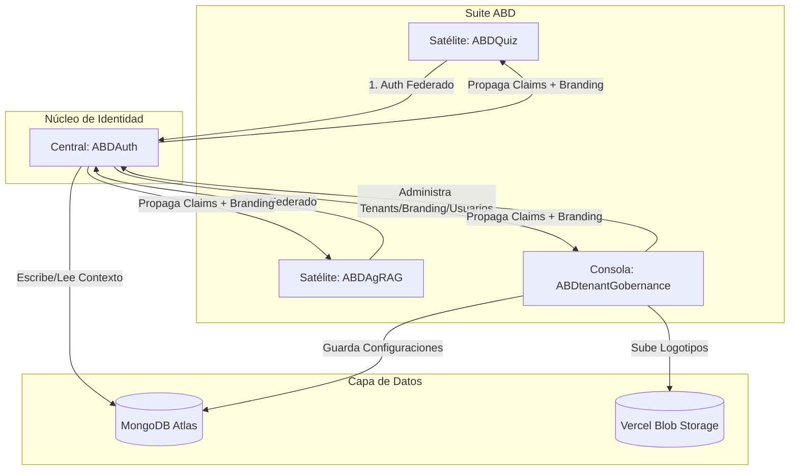
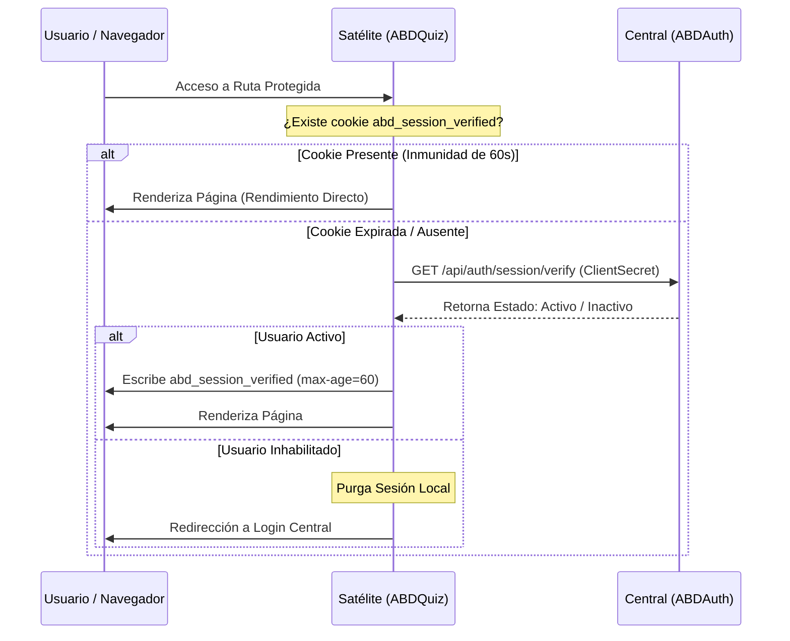

# 🏛️ Blueprint Arquitectónico: ABDtenantGobernance

Este documento recopila la especificación técnica, el mapa de integración de datos y las fronteras de responsabilidad para la nueva aplicación **`ABDtenantGobernance`**, encargada de la gobernanza central de organizaciones, usuarios y marcas visuales dentro de la suite corporativa **ABD** (junto con `ABDAuth`, `ABDQuiz`, `ABDAgRAG` y satélites futuros).

---

## 🧭 1. Visión General del Ecosistema ABD

La suite opera bajo un modelo de **Identidad Federada Centralizada con Satélites Especializados de Negocio**. El nuevo componente `ABDtenantGobernance` se inserta como el **cerebro administrativo y de gobernanza** de este ecosistema:



### Roles y Fronteras de Responsabilidad
1.  **`ABDAuth` (Identity Provider - IdP)**: Gobierna el flujo perimetral de inicio de sesión, resuelve desafíos de MFA (TOTP), y emite el JWT con los claims del usuario y metadatos de tematización.
2.  **`ABDtenantGobernance` (Control Plane)**: La aplicación actual. Es el panel de control exclusivo para los Super-Administradores y Administradores de Tenant. Permite crear tenants, asignar estrategias de aislamiento, gestionar usuarios y personalizar temas visuales (White-Label).
3.  **Satélites (`ABDQuiz`, `ABDAgRAG`, etc.)**: Aplicaciones de cara al cliente final que consumen la sesión federada, aíslan las consultas de base de datos de manera transparente y se "tiñen" dinámicamente con los colores del tenant en tiempo de ejecución.

---

## 🔑 2. Módulos Técnicos y Pilares de Gobernanza

La arquitectura multi-tenant de la suite ABD se basa en 5 pilares inviolables:

### 🛡️ Pilar A: Flujo SSO Federado y Claims de Sesión
Cuando un usuario inicia sesión, `ABDAuth` encapsula toda la información de límites y marca del tenant en el payload JWT. La cookie segura `abd_session` viaja a los satélites e inyecta este contrato:

```json
{
  "id": "60c72b2f9b1d8a23c4a10d9e",
  "email": "auditor@academia1.com",
  "name": "Carlos",
  "surname": "Sánchez",
  "role": "AUDITOR",
  "tenantId": "tenant_academia_01",
  "dbPrefix": "aca1",
  "isolationStrategy": "COLLECTION_PREFIX",
  "branding": {
    "logoUrl": "https://cdn.abd.com/logos/academia1.png",
    "theme": {
      "primary": "#ef4444",
      "secondary": "#1e293b",
      "rounded": true,
      "radius": "0.5rem"
    }
  }
}
```

### 🚨 Pilar B: Active Verification Guard (Prevención de Desfase de Roles)
Dado que las sesiones duran hasta 8 horas localmente en los satélites, un cambio de rol o la desactivación de un usuario en `ABDtenantGobernance` podría demorarse en propagarse. Para mitigarlo sin saturar la red, el **Active Verification Guard** impone una **Network Immunity Window**:



### 🚪 Pilar C: Cierre de Sesión en Cascada (Front-Channel SLO)
Para garantizar la destrucción inmediata de las cookies en todos los dominios de la suite:
1. El usuario cierra sesión en cualquier aplicación y la petición va a `ABDAuth/api/auth/logout`.
2. `ABDAuth` limpia su propia sesión y renderiza un HTML con `<iframe>` invisibles apuntando al endpoint de logout silencioso de cada satélite:
   ```html
   <iframe src="https://abdquiz.vercel.app/api/auth/logout?silent=true" style="display:none;"></iframe>
   ```
3. El satélite, al recibir `?silent=true`, expira inmediatamente la cookie local `abd_session` escribiendo cabeceras anti-caché y forzando la expiración en época (`new Date(0)`).

### 🗄️ Pilar D: Estrategias de Aislamiento de Datos
Soportamos dos modelos de segregación de base de datos en MongoDB Atlas:
*   **`COLLECTION_PREFIX` (Aislamiento Lógico Compartido)**: Múltiples tenants comparten la misma base de datos, pero las colecciones se nombran de forma dinámica anteponiendo el `dbPrefix` (ej. `aca1_questions`, `aca2_questions`). Minimiza costes de infraestructura de forma óptima.
*   **`DATABASE_PER_TENANT` (Aislamiento Físico Dedicado)**: Cada tenant tiene su base de datos física dedicada. El enrutador de conexión cambia dinámicamente el destino en base a `dbPrefix` para clientes corporativos de alto nivel de cumplimiento regulatorio (RGPD, SOC2).

### 🎨 Pilar E: Motor Estético Dynamic-on-Demand (`@abd/styles`)
El motor de White-Label resuelve la latencia estética y cumple los estándares de accesibilidad sin comprometer el rendimiento:
1.  **Conversión Hex-to-HSL**: Traduce colores hexadecimales plano (`#06b6d4`) a componentes HSL separados por espacios (`188 86% 43%`) para que Tailwind CSS v4 aplique opacidades dinámicas sin generar FOUC (*Flash of Unstyled Content*).
2.  **Algoritmo YIQ Contrast**: Calcula la luminancia del color primario. Si el administrador elige un color de marca muy claro, el texto de los botones principales cambia dinámicamente a negro (`#000000`); de lo contrario, se tiñe de blanco (`#ffffff`), asegurando accesibilidad WCAG.
3.  **Ajuste Bitwise para Modo Oscuro**: Realiza desplazamientos de bits hexadecimales para atenuar colores intensos en la interfaz cuando el usuario activa el modo oscuro, reduciendo la fatiga visual.
4.  **Inyección SSR (Zero-FOUC)**: El `RootLayout` inyecta en el servidor la etiqueta `<style id="tenant-branding-gateway">` directamente en el `<head>` antes de enviar el HTML al navegador, eliminando molestos parpadeos cromáticos durante la carga.

---

## 📂 3. Plan de Transferencia y Boilerplate Copiado

El usuario ha copiado parte de **ABDQuiz** a este directorio para usarlo como punto de partida. Tras la inspección del árbol de archivos, identificamos lo siguiente:

### Módulos del Boilerplate (Histórico)
El proyecto fue inicializado a partir de un scaffold de ABDQuiz. Los módulos específicos de Quiz (rutas de exámenes, componentes de preguntas, servicios de corpus) fueron eliminados durante las fases de sanitización inicial y mediante `scripts/clean-quiz.js`.

### Infraestructura Core Actual
*   **`src/app/layout.tsx` y `src/app/[locale]/layout.tsx`**: Implementan detección de subdominios, inyección SSR de estilo dinámico con `@abd/styles` e inicialización de `next-intl`.
*   **`src/lib/session.ts`**: Extracción perimetral de la cookie `abd_session` y aserciones de seguridad (`ensureIndustrialAccess`). (Nota: `auth-bridge.ts` fue eliminado — su funcionalidad fue reemplazada por `@abd/satellite-sdk`).
*   **Sistema de Carpetas de Localización (`messages/`, `src/i18n/`)**: Soporte nativo multi-idioma ya integrado.

### Componentes Clave a IMPORTAR/CREAR (Gobernanza de Tenants)
Para la fase de desarrollo, implementaremos los siguientes bloques limpios:
1.  **`TenantSchema` (Zod)**: Validación estricta para la persistencia del Tenant, estructura de branding y esquinas redondeadas.
2.  **`TenantAwareRepository.ts`**: Repositorio de base de datos MongoDB Atlas que encapsula el filtro implícito de `tenantId` para proteger el aislamiento de los datos.
3.  **`TenantBrandingForm.tsx` (Premium UI)**: Consola interactiva de marca blanca con previsualización en tiempo real de componentes simulados, selector de color, radio de bordes adaptativo e integración para subir logos oficiales.
4.  **Server Action (`updateTenantBrandingAction`)**: Integración con **Vercel Blob Storage** para subida asíncrona de logos en CDN y persistencia limpia en MongoDB.

---

## 🛠️ 4. Variables de Entorno del Proyecto (.env.local)

Para garantizar la conexión de red y almacenamiento en la nube, el archivo `.env.local` requerirá de las siguientes credenciales:

```env
# 🗄️ Conexión MongoDB Atlas
MONGODB_URI="mongodb+srv://..."
MONGODB_DB="ABDElevators-Auth"

# 🛡️ Pasarela SSO
AUTH_PROVIDER_URL="http://localhost:3400" # URL central de ABDAuth

# 🏞️ CDN para Logotipos (Vercel Blob)
BLOB_READ_WRITE_TOKEN="vercel_blob_rw_xxxxx..."
```

---

## 🚀 5. Próximos Pasos Recomendados (Fase de Construcción)

Una vez aprobada esta contextualización por el usuario, el orden ideal de ejecución será:

- [x] **Fase 1: Sanitización**: Eliminado el código muerto de ABDQuiz.
- [x] **Fase 2: Capa de Persistencia**: Creado `TenantRepository` y configuradas las colecciones.
- [x] **Fase 3: Motor Estético**: Integrado `@abd/styles` con inyección SSR.
- [x] **Fase 4: Consola de Branding**: Implementado `TenantBrandingForm.tsx` con Live Preview y Cloudinary.
- [x] **Fase 5: Panel de Control de Tenants**: CRUD de administración global completado.
- [x] **Fase 6: Pruebas de Integración**: Validadas.
